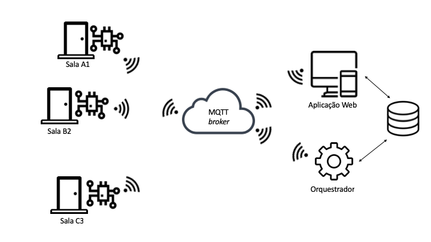
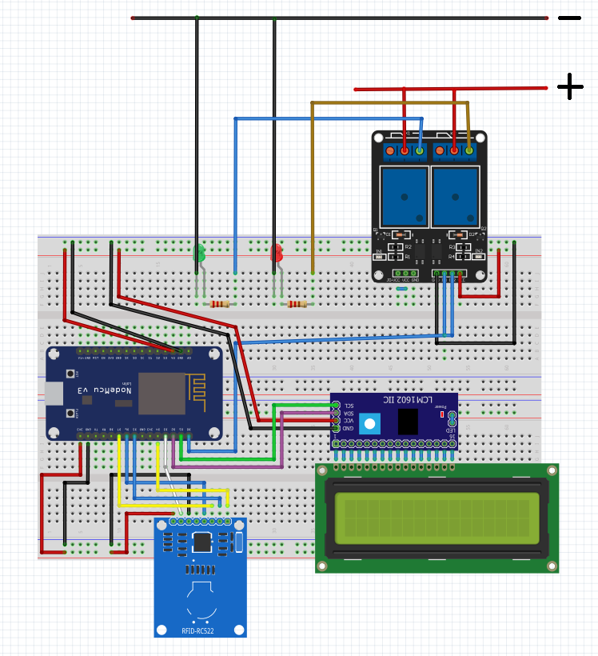

# Sistema de Controle de Acesso a Múltiplos Ambientes Baseada em Internet das Coisas

## Apresentação

Este repositório git contempla os  resultados produzidos em decorrência do trabalho de conclusão de curso desenvolvido pela aluna **Letícia da Silva Mota** e orientado pela Profa. **[Elloá B. Guedes](http://www.elloaguedes.com)**. A proposta desenvolvida tratou de um projeto aberto de sistema de controle de acesso a múltiplos ambientes, integrando um projeto de hardware e software dos objetos inteligentes e também um painel administrativo web para gerenciamento de agendamentos, usuários e salas.

Contato: leticiaamota@gmail.com

Nas seções a seguir, estão disponíveis informações detalhadas para reprodução da solução proposta.

## Tecnologias Utilizadas

Este projeto envolve o uso de diversas tecnologias, com destaque para:

* **Python**: É uma linguagem de programação de alto nível, interpretada e de script, funcionando muito bem para servidores web. Neste projeto a linguagem foi usada na implementação do código do Orquestrador e também no desenvolvimento da aplicação web, onde combinou-se a outras liguagens a citar HTML e CSS. Para isso, indica-se o [download](https://www.python.org/downloads/) do interpretador da linguagem para efetiva reprodução dos códigos aqui apresentados.

* **RFID**: A Identificação de Rádio-Frequência (RFID, do inglês, Radio-Frequency Identification) descreve qualquer sistema de identificação no qual um dispositivo eletrônico, de maneira wireless, seja por rádio-frequência ou variações de campo magnético, comunica-se com leitores, considerando uma certa distância. Neste projeto, utiliza-se RFID para a interação de usuários comuns ao sistema a partir de cartões RFID que os identificam, permitindo assim a validação de seus acessos aos ambientes.

* **MQTT**: O MQTT (do inglês, Message Queuing Telemetry Transport) é um protocolo de conectividade máquina-a-máquina (M2M), muito utilizado em aplicações de Internet das Coisas, caracterizando-se pelo transporte extremamente leve de mensagens através do mecanismo publish-subscribe (em tradução literal, publicação-assinatura).

* **NodeMCU**: Trata-se de um microcontrolador que disponibiliza portas lógicas para a conexão física entre ele e outros componentes e, por meio de um software embarcado, realiza a conexão lógica dos mesmos, o que possibilita a entrada, saída e manipulação de dados trocados entre estes elementos. No contexto considerado, representa o elemento central de processamento do objeto inteligente.

De maneira geral, a proposta do sistema é ilustrada a partir da imagem abaixo onde são considerados todos os módulos projetados e suas respectivas interações.

## Padronização de Tópicos de Comunicação

A comunicação realizada entre módulos do sistema aqui apresentado é definida pelo protocolo MQTT, baseado no padrão publisher/subscriber, e portanto adota a utilização de tópicos para a distribuição de mensagens publicadas a seus respectivos assinantes.

Neste projeto foram especificados dois principais tópicos para a interação entre módulos: (i) o tópico de entrada e (ii) o tópico de saída.

O tópico de entrada, definido pelo título topicoEntrada, representa o canal de transmissão de informação cujo fluxo é no sentido orquestrador-objeto ou aplicação web-objeto. O padrão de construção desse tópico dá-se pela regra **topicoEntrada/codigo_da_sala/funcionalidade_executada** e permite a inclusão de novos objetos inteligentes e novas funcionalidades a partir desta definição.

As funcionalidades definidas neste projeto para a relação aplicação web-objeto, são:
- topicoEntrada/codigo_da_sala/associarTagUser
- topicoEntrada/codigo_da_sala/associarTagMaster

Para o fluxo orquestrador-banco-objeto tem-se a função definida por:
- topicoEntrada/codigo_da_sala/confirmarAgendamento

De maneira análoga, define-se o tópico de saída pelo título topicoSaida, representando o canal de transmissão de informação com fluxo contrário, cujo sentido é objeto-orquestrador. O padrão de construção de tópicos é semelhante, dado por: **topicoSaida/codigo_da_sala/funcionalidade_executada**.

O objeto relaciona-se com o orquestrador para a persistência ou consulta de informações no banco por meio das funções definidas seguintes nos tópicos:
- topicoSaida/codigo_da_sala/salvarTagUser
- topicoSaida/codigo_da_sala/salvarTagMaster
- topicoSaida/codigo_da_sala/validarAgendamento.

## Objeto Inteligente

### Hardware
A descrição do hardware do objeto inteligente consiste na definição e concepção do arranjo dos componentes que proporcionam o controle de acionamento de fechadura, da leitura de tags RFID e do estabelecimento de uma interface de saída de dados permitindo a inspeção visual do acesso concedido.

#### Componentes
Considerando as funcionalidades elencadas, os componentes utilizados no projeto de hardware do sistema de controle de acesso proposto são pontuados a seguir:
- NodeMCU - Modelo v3 Lolin
- Módulo Leitor RFID - Modelo Mfrc522 Mifare
- Visor LCD 16x2 - Modelo Backlight Azul
- Módulo Serial I2C para Display LCD - Modelo FC-113
- Módulo Relé com 2 canais - Modelo SRD-05VDC-SL-C
- LEDs
- Resistores 220 Ω

O projeto definido para conexão dos elementos, visando alcançar o objetivo proposto, é ilustrado abaixo.

### Software

O software embarcado no objeto inteligente compreende a porção de código desenvolvida para realizar a conexão lógica dos elementos físicos do hardware do objeto, assim como a publicação e inscrição deste protótipo em tópicos de comunicação com o MQTT Broker.
Este software foi desenvolvido no Ambiente de Desenvolvimento Integrado do Arduino (IDE Arduino) dada sua compatibilidade com a plataforma NodeMCU e os demais elementos físicos presentes na solução. A IDE Arduino permite a utilização de bibliotecas que tratam as características específicas dos elementos utilizados no protótipo do objeto, tornando a interação entre eles mais fácil e transparente ao programador.

O código desenvolvido está disponível para download no diretório: [sw-objeto-inteligente](source/codigo-nodemcu/sw-objeto-inteligente).

### Tutorial para execução

Para realizar o upload do código ao microcontrolador NodeMCU, deve-se primeiramente obter a plataforma de desenvolvimento do Arduino, que pode ser encontrada neste [link](https://www.arduino.cc/en/Main/Software).

Além disso, na própria plataforma pode-se realizar a gerência de bibliotecas do sistema, a citar as utilizadas neste projeto: ArduinoJson, Wire, LiquidCrystal_I2C, ESP8266WiFi, PubSubClient, SPI, MFRC522.

Algumas das quais podem ser encontradas no diretório: [bibliotecas](source/codigo-nodemcu/bibliotecas).

Como observação final para a execução deste módulo, citamos a alteração do SSID e PASSWORD da rede a ser utilizada em sua execução no diretamente no código.

## Orquestrador

O Orquestrador de saída de dados do objeto é um software, desenvolvido na linguagem Python, que otimiza o processamento de dados solicitados pelo objeto e realiza atividades específicas de acordo com esta solicitação. Suas principais atribuições são:

- Realizar a conexão lógica com o MQTT Broker, utilizando a biblioteca paho.mqtt.client, o que possibilita a inscrição e publicação a tópicos relacionados aos objetos;

- Identificar os padrões de tópicos utilizados para comunicação com os objetos por meio de consultas ao banco de dados;

- Estabelecer funções para validação de agendamento e cadastro de novas tags de acordo com o canal de comunicação (tópico) de recebimento;

- Validar informações de agendamento a partir de uma comparação entre a tag recebida e a informação persistida no banco de dados;

- Realizar a associação de uma nova tag a um usuário, a partir da persistência desse dado ao banco de dados.

### Tutorial para execução
Para a execução deste módulo, necessita-se a instalação do interpretador python e das bibliotecas: [Paho MQTT](https://pypi.org/project/paho-mqtt/) e [Sqlite3](https://pypi.org/project/db-sqlite3/).

Após ter realizado as instalações conforme informado, deve-se realizar o download do módulo, disponível no diretório: [codigo-orquestrador](source/codigo-orquestrador).

Alterar o conteúdo da variável DB_Name, no arquivo DAL.py, para o caminho correspondente ao banco de dados do sistema web em seu sistema.

E por fim executar o arquivo subscriber-pc, responsável por receber informações do Broker MQTT para efetuar o processamento de dados.

## Aplicação Web

A aplicação web do sistema compreende o projeto de software responsável por proporcionar uma interação de alto-nível com os objetos inteligentes que compõem a solução de controle de acesso. Para tanto, caracteriza-se por um painel administrativo que, para o usuário administrador, permitirá a realização de procedimentos como cadastro de novos objetos inteligentes, inserção de novos usuários e também para inclusão de agendamentos que darão validade ao acesso. No caso de usuários comuns, este painel administrativo permite consultas aos dados relativos à pontualidade. Para implementação deste componente, propõe-se então o framework Web2py, fazendo uso do padrão arquitetural MVC, responsável por separar a representação dos dados de sua apresentação aos usuários.

O diretório [codigo-web2py](source/codigo-web2py) dispõe de todas as configurações necessárias para a execução deste módulo.

Para seu funcionamento regular necessita-se executar o arquivo web2py.py que irá iniciar o servidor local e pelo browser acessar a url http://127.0.0.1:8000/controledeacesso/default/home.
